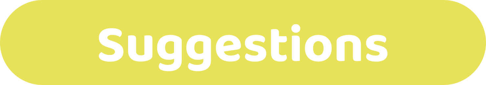

# About

<figure><figcaption></figcaption></figure>

The following resources provide suggestions for Web 3 ecosystems to consider when iterating on and improving their own treasury systems and processes.&#x20;

**Suggestion structure**

* **Suggestion** - What the suggestion is for thinking about and improving treasury systems.
* **Why adopt this suggestion?** - Reasons why an ecosystem might decide to adopt the suggestion.
* **Why ignore this suggestion?** - Reasons why an ecosystem might choose to ignore the suggestion.
* **Relevant resources** - List of any resources worth reviewing that are relevant to the suggestion.
