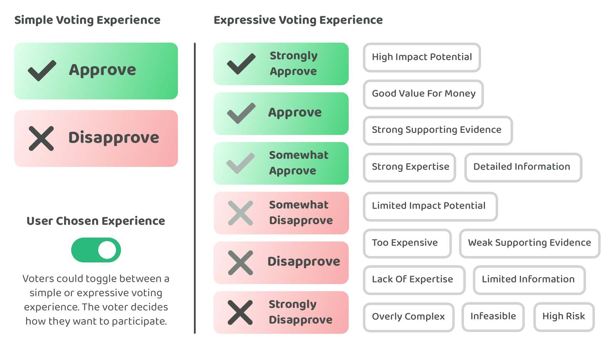

# Treasury suggestions

The [treasury analysis](https://app.gitbook.com/o/jOQu4b6VLDxaQsg2rVwG/s/qIN4B3DGHPqKOl7e6VuV/) has compared a number of approaches that are relevant for treasury systems such as voting power, voting and funding process comparisons. The following is a list of some of the most promising approaches that have been identified.

## 1. Voting power - Locked wealth based & tax contributions

<figure><figcaption></figcaption></figure>

Wealth based voting power is a suitable approach in the short term as most ecosystems need to attract a sufficient amount of capital and investment into the ecosystem to support the growth of the network and for developing new use cases. Capital invested into the network will make any genesis allocation for the treasury more valuable. Wealth based voting power is not fair over the long term as it gives wealthy individuals perpetual control and influence over how the network is operated. Tax contributions become one of the most important contributions to the ecosystem over the long term as the fees from transaction fees are required for the network to survive. A hybrid approach of wealth and tax based voting power helps to accommodate these two types of contribution. How the industry evolves over time will influence what other voting power approaches might also be necessary to ensure the network's fee model is fair and that it doesn't give certain people an unfair advantage over others. Relevant resources:


[Voting power approaches](https://app.gitbook.com/s/qIN4B3DGHPqKOl7e6VuV/voting/voting-power-approaches)


## 2. Voting - Score voting

<figure><figcaption></figcaption></figure>

There are a number of different voting approaches that could be used. Plurality, majority, proportional, preference and score voting systems cover a wide range of existing approaches. Score voting was one of the most flexible approaches as it could be used for binary decisions and both single selection and multiple selection decisions. Score voting is also one of the more effective approaches for someone to express the intensity of their preference whilst voting. Relevant resources:


[Voting approaches](https://app.gitbook.com/s/qIN4B3DGHPqKOl7e6VuV/voting/voting-approaches)


## 3. Score voting - Expressive approval voting with a mass disapproval option

<figure><figcaption></figcaption></figure>

Score voting can be broken down into its different parts and then the approaches that could be used within each of those parts can be compared to identify any promising approaches that Web3 ecosystems could use. After comparing a number of approaches within score voting systems the most promising suggestion that emerged was the usage of an expressive form of approval voting that also has a mass disapproval option. The same voting option structure being suggested for approval voting can also be applied to binary voting meaning that both binary voting and approval voting could both adopt this more expressive variation. Relevant resources:


[Score voting approaches](https://app.gitbook.com/s/qIN4B3DGHPqKOl7e6VuV/voting/score-voting-approaches)


## 4. Ecosystem funding - Contributor funding

<figure><figcaption></figcaption></figure>

There are a number of projects that mint a token for their project to then try and create a circular economy through transaction fees. Token based funding can be highly problematic for increasing funding, token utility, community usage and contributor collaboration complexities. Token funding can also decrease the amount of contribution flexibility that people have to make an impact across the ecosystem. Tokens are often not necessary for a number of Web3 projects. Contributor funding provides a more reliable and simple approach for developing projects that don't need a separate token. Relevant resources:


[Idea token vs contributor network funding](https://app.gitbook.com/s/qIN4B3DGHPqKOl7e6VuV/funding/idea-token-vs-contributor-network-funding)

